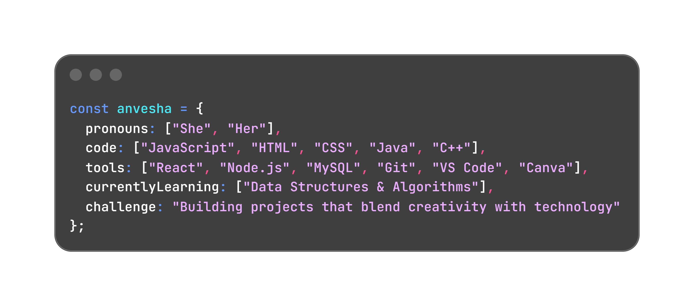

<h1 align="center">Hii , I Am Anvesha &nbsp;</h1>

  

 

  
  

  

<code></code>
<code></code>
<code></code>
<code></code>
<code></code>
<code></code>
<code></code>

 

<code></code>
<code></code>
<code></code>
<code></code>
<code></code>
<code></code>
<code></code>

 

   
   
  

 
<picture>
  <source media="(prefers-color-scheme: dark)" srcset="https://raw.githubusercontent.com/Anvesha-Sri/Anvesha-Sri/pacman-output/galaga-contribution-graph-dark.svg">
  <source media="(prefers-color-scheme: light)" srcset="https://raw.githubusercontent.com/Anvesha-Sri/Anvesha-Sri/pacman-output/galaga-contribution-graph.svg">
  
</picture>
 

 <em><b>I love connecting with different people</b> so if you want to say <b>hi, I'll be happy to meet you more!</b> :)</em>

 

  
  
  
  
  

